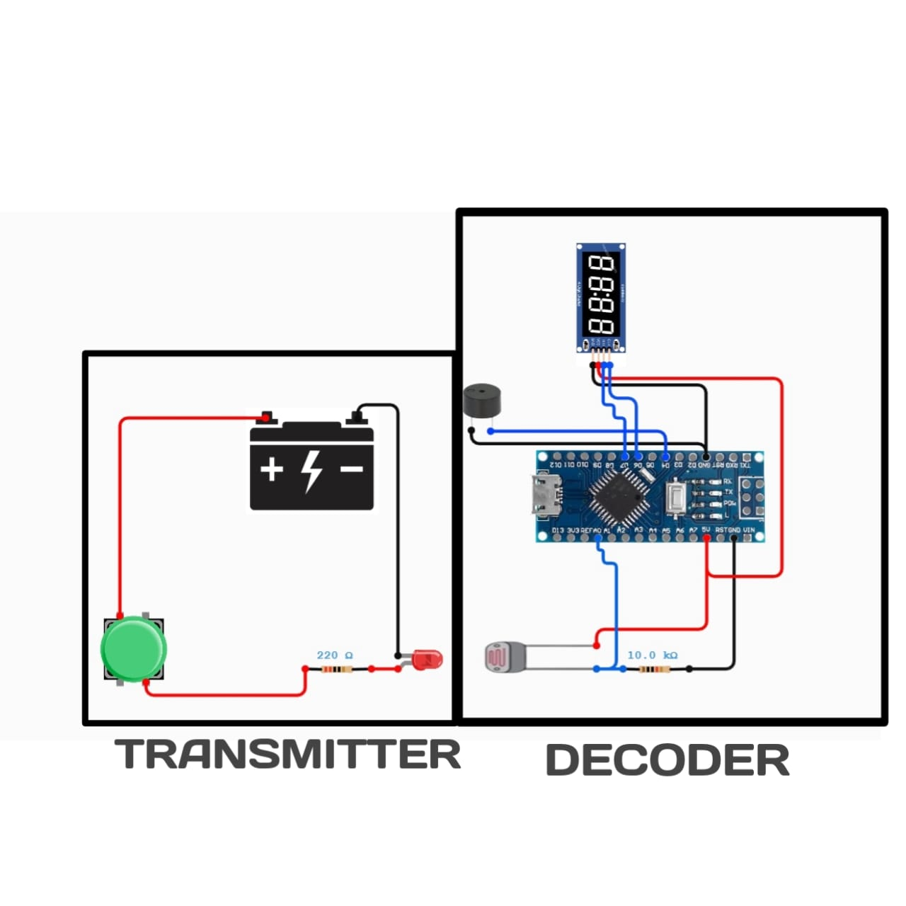

# LiFi Based Morse Code Communication (Arduino)

This project demonstrates optical wireless communication using LiFi (Light Fidelity).  
Morse code is transmitted using LED light and received using an LDR sensor.  
The received light pulses are decoded back into readable characters and shown on a 7-segment display / Serial Monitor.  
The system works completely offline and uses simple, low-cost components.

---

## 🔧 Components Used

- Arduino UNO / Nano (Receiver)
- High Brightness LED (Transmitter)
- Push Button (Manual Morse input)
- LDR (Light Dependent Resistor) – Receiver
- 10kΩ Resistor (for LDR voltage divider)
- 220Ω Resistor (for LED protection)
- TM1637 4-Digit 7-Segment Display
- Buzzer
- Battery / 5V supply (for transmitter LED)
- Breadboard
- Jumper Wires

---

## 🔌 Circuit Connections

### 🔹 Transmitter (Simple Button + LED)

| Component        | Connection |
|------------------|------------|
| Battery +        | Push Button |
| Push Button      | 220Ω Resistor |
| 220Ω Resistor    | LED Anode (+) |
| LED Cathode (–)  | Battery – (GND) |

**Working (Transmitter):**  
- Pressing the push button turns ON the LED.  
- Short press = Dot (.)  
- Long press = Dash (–)  
- LED sends Morse code as light pulses (LiFi).

---

### 🔹 Receiver (Arduino + LDR + Display + Buzzer)

| Component            | Arduino Pin |
|----------------------|-------------|
| LDR one end          | 5V |
| LDR other end        | A0 |
| 10kΩ Resistor        | A0 to GND |
| Buzzer +             | D4 |
| Buzzer –             | GND |
| TM1637 CLK           | D6 |
| TM1637 DIO           | D7 |
| TM1637 VCC           | 5V |
| TM1637 GND           | GND |
| Arduino 5V           | 5V |
| Arduino GND          | GND |

---

## ⚙️ Working Principle

### Transmitter Side
- User sends Morse code manually using the push button.  
- Short press = Dot (.)  
- Long press = Dash (–)  
- LED blinks according to the Morse pattern.  
- Light pulses carry the information (LiFi).

### Receiver Side
- LDR senses incoming light pulses from the LED.  
- Arduino reads analog values from LDR.  
- ON-time duration is measured using `millis()`:
  - Short ON → Dot (.)
  - Long ON → Dash (–)
- Morse code is matched with a lookup table to decode letters (A–Z).  
- Decoded characters are displayed on:
  - Serial Monitor  
  - 7-Segment Display (TM1637)  
- Buzzer gives sound feedback while receiving light.

---

## ▶️ How to Run

1. Build the transmitter (button + LED + 220Ω resistor + battery).  
2. Build the receiver (Arduino + LDR divider + TM1637 + buzzer).  
3. Upload the receiver code to Arduino.  
4. Open Serial Monitor (9600 baud).  
5. Place LED facing the LDR (line of sight).  
6. Press the button to send Morse code.  
7. Observe decoded characters on Serial Monitor / 7-segment display.

---

##  Project Structure

---

##  Notes

- LDR threshold depends on room lighting.  
- Adjust threshold by checking Serial Monitor values.  
- Keep LED and LDR aligned for better reception.  
- Bright ambient light may affect accuracy.  
- Use 220Ω resistor with LED to avoid damage.

---

##  Output

---
 
